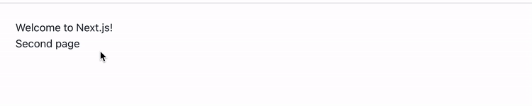
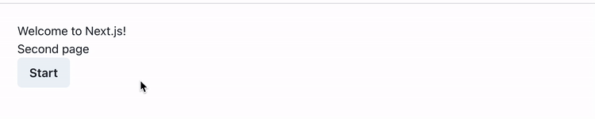

Next.js empty project with tools we love 😻

<h1 align="center">Next.js Starter</h1>

## Quick Start

1. Clone the repo.
2. Change directory into the project `cd nextjs-starter`
3. Install dependencies with `yarn install`.
4. Run development server with `yarn dev`.
5. Enjoy! 🎉

## Branches

- `empty-project` check [Start New Next.js Project Notes](https://dev.to/vladimirvovk/start-new-next-js-project-notes-13m3) for details

- `loading-progress` check [Page Loading Progress with Next.js and Chakra UI](https://dev.to/vladimirvovk/page-loading-progress-with-next-js-and-chakra-ui-h11) for details

</img>
</img>
